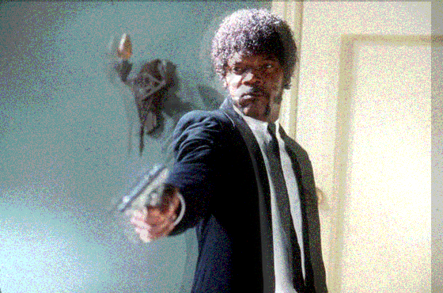
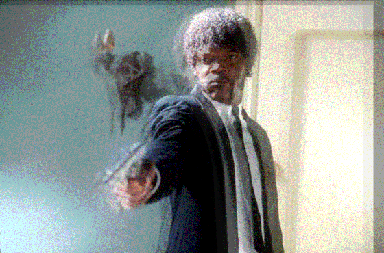
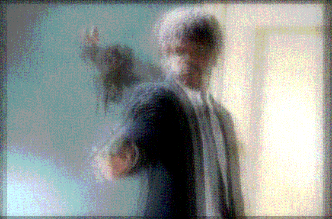
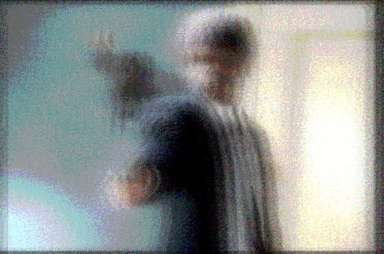
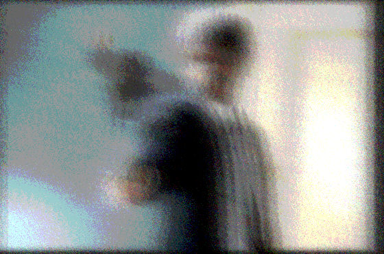
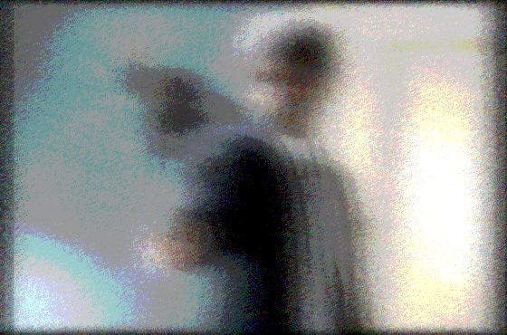
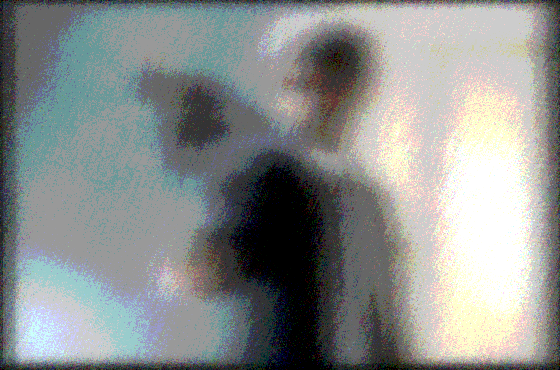

Introduction
============

* This is a small tool to create iterative image effects.
* There is a small (but growing> number of filters implemented at this point.
* Their application and configuration can be set up in a simple json config file.

```bash
usage: main.py [-h] [-c CONFIG] [--loglevel LOGLEVEL]
               [--filterconf FILTERCONF] [--iter ITER]
               [--save_steps SAVE_STEPS] [--scan_inverval_s SCAN_INVERVAL_S]
               [--display_inverval_s DISPLAY_INVERVAL_S]
               [--file_pattern FILE_PATTERN]
               image_dir temp_image_dir

positional arguments:
  image_dir             path to scan for new images
  temp_image_dir        path for converted images. must be different from image_dir!                       

optional arguments:
  -h, --help            show this help message and exit
  -c CONFIG, --config CONFIG
                        config file path
  --loglevel LOGLEVEL, -l LOGLEVEL
                        ERROR, WARNING, INFO, or DEBUG
  --filterconf FILTERCONF, -f FILTERCONF
                        path to filter configuration file
  --iter ITER, -n ITER  number of iterations
  --save_steps SAVE_STEPS, -m SAVE_STEPS
                        save every n steps
  --scan_inverval_s SCAN_INVERVAL_S, -s SCAN_INVERVAL_S
                        scan interval in s
  --display_inverval_s DISPLAY_INVERVAL_S, -d DISPLAY_INVERVAL_S
                        display interval in s
  --file_pattern FILE_PATTERN, -p FILE_PATTERN
                        scan file pattern
```


* This will read the image ``example.jpg`` and will run 20 times, each time applying all the filters specified in ``example.json``.
* The original and the final image, as well as every 2nd intermmediate will be saved as <original_file_name>.00000x.png

* The config file is a simple json file with a list of filters that are applied at each iteration.
* Each filter has a ``name`` and a number of keyword arguments ``kwargs`` that are specific to that filter
* The number of iterations and how many intermeddiate files will be saved can be specified as command line arguments

Example
=======

We use this image


   
and this config file:

```json
[
{
    "name": "noise",
    "kwargs": {
        "min": 0.0,
        "max": 0.1
    }
},
{
    "name": "gaussian",
    "kwargs": {
        "sigma": 0.4
    }
},
{
    "name": "colordepth",
    "kwargs": {
        "n_colors": 5
    }
},
{
    "name": "random_offset",
    "kwargs": {
        "alpha": 0.2,
        "dx": 0.02,
        "dy": 0.03
    }
}
]
```


This will apply 

* a little bit of random noise
* some blurring
* some color reduction
* and some random offset overlay

for each iteration.
Running this a few times renders this nice sequence:


   



   



   


   


   


   


   



   


   



   


   


   



   


   


   


   



   


   


   



   


   

