Example
=======

We use this image

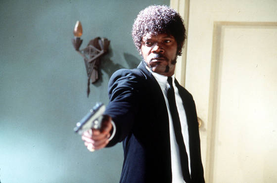
   
and this config file:

.. literalinclude:: _static/example/samj.json

This will apply 

* a little bit of random noise
* some blurring
* some color reduction
* and some random offset overlay

for each iteration.
Running this a few times renders this nice sequence:

   
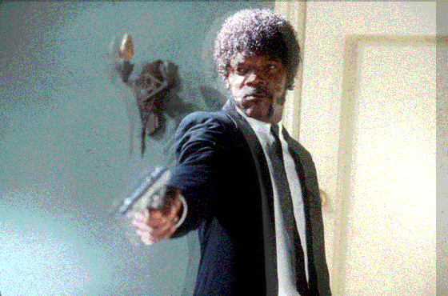
   
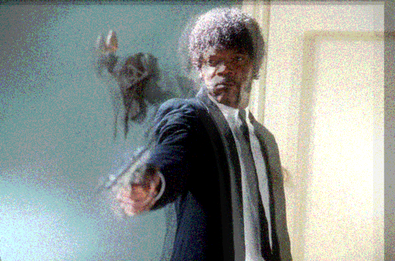
   

   

   
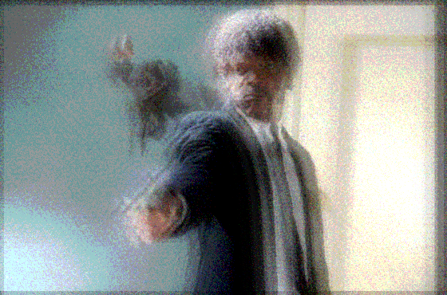
   
.. image:: _static/example/samj.jpg.000006.png
   :width: 40 %
   :align: center
   
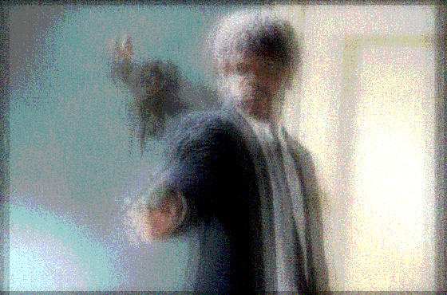
   
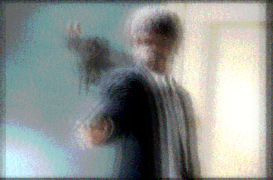
   
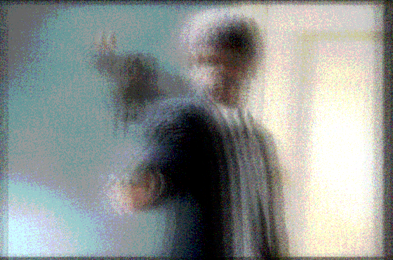
   
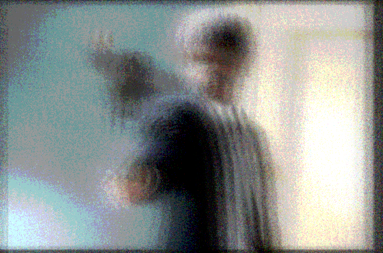
   

   

   
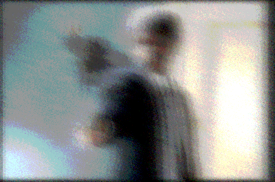
   

   

   
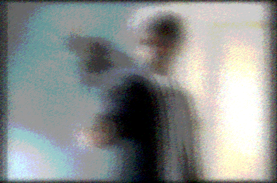
   

   

   
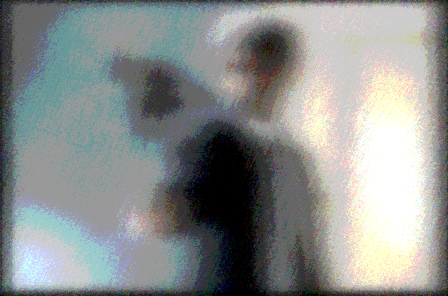
   
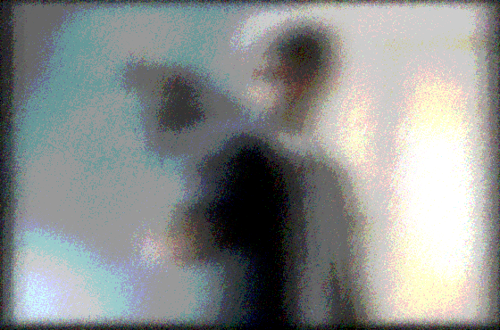